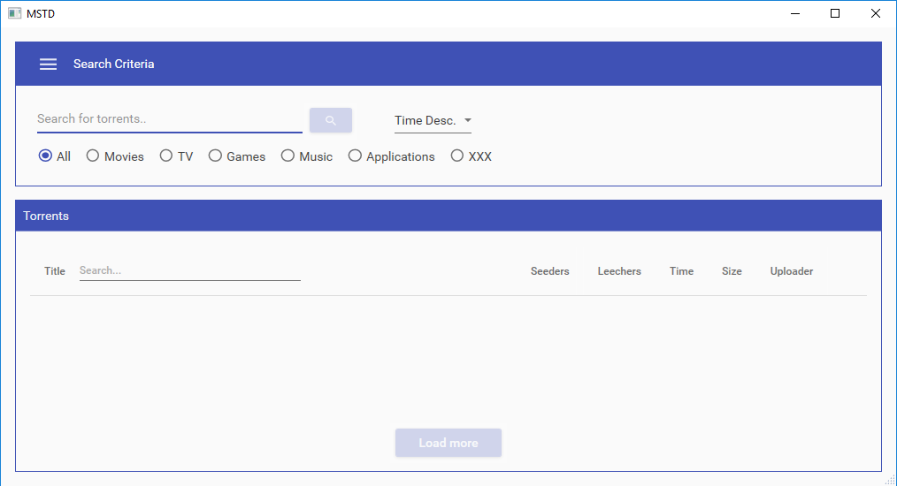
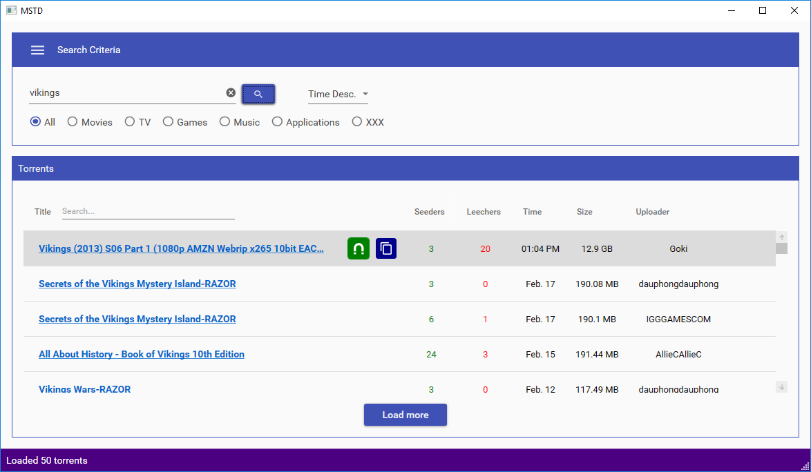
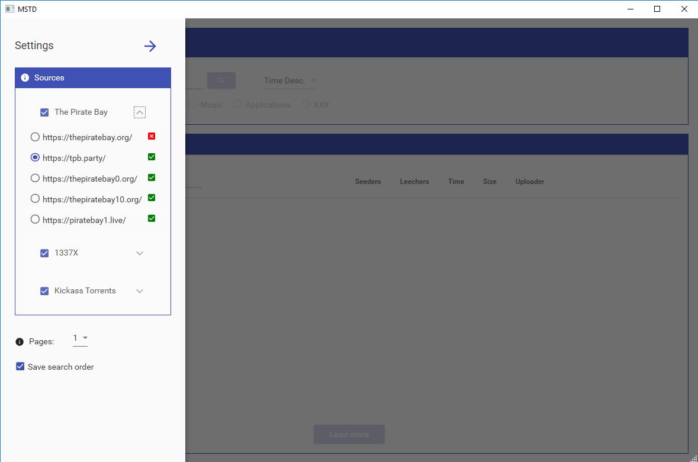
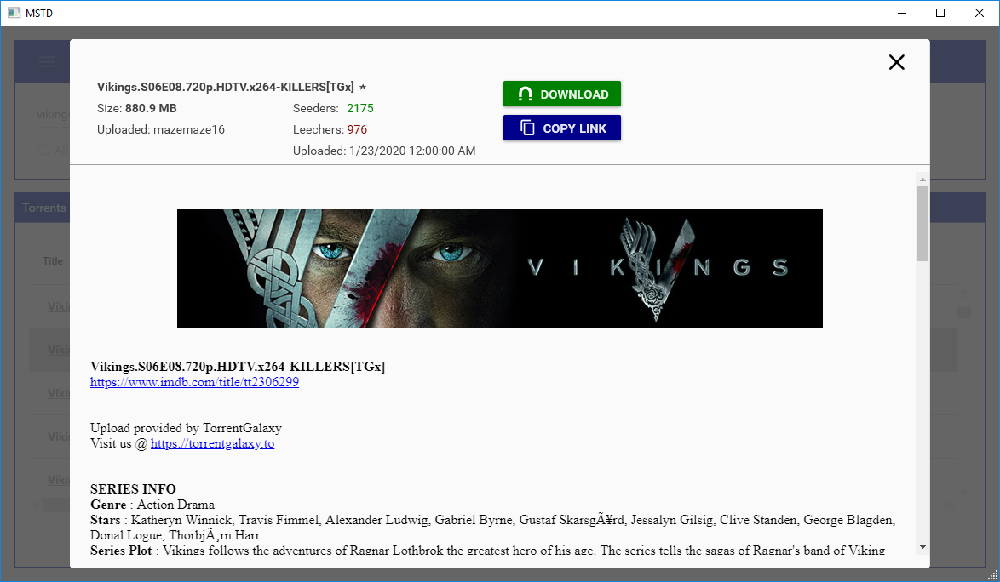

# MultiSourceTorrentDownloader
An app that gets torrents from multiple sites (like thepiratebay, 133tx.to) and shows them in one place with the ability to download with local app (this app only opens the magnet/torrent, a separate app like uTorrent or BitTorrent is required)<br>


## Compilation
- Target the solution for x86 or x64 (needed for CefCharp chromium browser)
- App.xaml.cs file requires a Secret.cs file for Syncfusion framework which contains a license key. One can replace that code with empty string and use trial license or create an account for Syncfusion and generate a lifetime community license key. Example of the Class
```C#
public class Secret
{
    public static string SyncFususionLicenseKey { get; } = "MySecretLicenseKey";
}
```

## Releases
[Download page](https://github.com/aivarasatk/MultiSourceTorrentDownloader/releases) <br>
Unzip the file and launch the MultiSourceTorrentDownloader.exe or create a shortcut for it (installer is planned in future) <br>
<b>Some users have reported that torrents are not launching on their local torrent download app a fix for that is to execute the app as admin</b>

## Future
This is an ongoing project. Progress board can be viewed on [Trello](https://trello.com/b/O3gltd5G/multi-source-torrent-downloader)

### Screenshots





## Contributing
[MIT license](license.txt)
